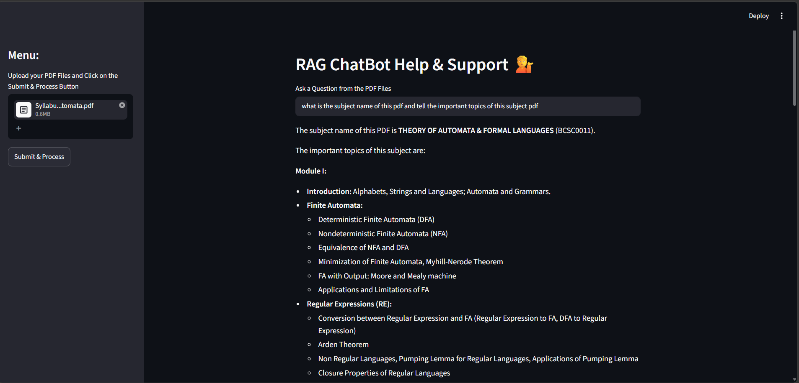
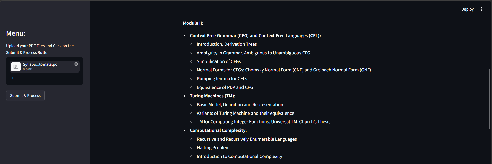

# 🤖 RAG ChatBot Help & Support

An AI-powered PDF Question Answering Chatbot built using Streamlit, LangChain, Google Gemini, and FAISS.

The application allows users to upload PDF documents and ask questions based on the uploaded content. The chatbot retrieves the most relevant information from the document and generates accurate answers using Google Gemini.

---

## 🚀 Features

- Upload PDF files
- Extract text from PDF documents
- Intelligent text chunking
- Vector embeddings using Google Gemini
- FAISS vector database for semantic search
- Context-aware question answering
- Fast and interactive Streamlit interface
- Retrieval Augmented Generation (RAG)

---

## 🛠️ Tech Stack

### Frontend
- Streamlit

### Backend
- Python

### AI / LLM
- Google Gemini 2.5 Flash
- LangChain

### Vector Database
- FAISS

### Embeddings
- Google Generative AI Embeddings

### PDF Processing
- PyPDF2

---

## 📂 Project Structure

```bash
ChatBot-main/
│
├── assets/
│   ├── Syllabus_Theory_of_Automata.pdf
│   ├── question_1.png
│   └── question_2.png
│
├── faiss_index/
│   ├── index.faiss
│   └── index.pkl
│
├── app.py
├── requirements.txt
├── .env
└── README.md
```

---

## ⚙️ Installation

### Clone Repository

```bash
git clone https://github.com/your-username/RAG-ChatBot.git
cd RAG-ChatBot
```

### Create Virtual Environment

```bash
python -m venv venv
```

### Activate Environment

#### Windows

```bash
venv\Scripts\activate
```

#### Linux / Mac

```bash
source venv/bin/activate
```

### Install Dependencies

```bash
pip install -r requirements.txt
```

---

## 🔑 API Configuration

Create a `.env` file:

```env
GOOGLE_API_KEY=your_google_api_key
```

Get your Gemini API Key from:

https://aistudio.google.com/app/apikey

---

## ▶️ Run Application

```bash
streamlit run app.py
```

Open:

```text
http://localhost:8501
```

---

## 🔄 Workflow

```text
PDF Upload
      │
      ▼
Text Extraction
      │
      ▼
Text Chunking
      │
      ▼
Generate Embeddings
      │
      ▼
Store in FAISS
      │
      ▼
User Question
      │
      ▼
Similarity Search
      │
      ▼
Relevant Context
      │
      ▼
Gemini LLM
      │
      ▼
Final Answer
```

---

## 📄 Sample PDF

The project was tested using:

```text
Syllabus_Theory_of_Automata.pdf
```

This PDF contains course syllabus and academic content used for chatbot testing.

---

## 📸 Screenshots

### Question Answering Example 1



---

### Question Answering Example 2



---

## 🎯 Learning Outcomes

Through this project I learned:

- LangChain Fundamentals
- RAG (Retrieval Augmented Generation)
- FAISS Vector Databases
- Google Gemini Integration
- Embeddings and Semantic Search
- Streamlit Application Development
- PDF Processing using Python

---

## 🔮 Future Enhancements

- Chat History
- Conversation Memory
- Document Summarization
- Voice Assistant Integration
- Cloud Deployment

---

## 👨‍💻 Author : **Yatendra Gupta**
